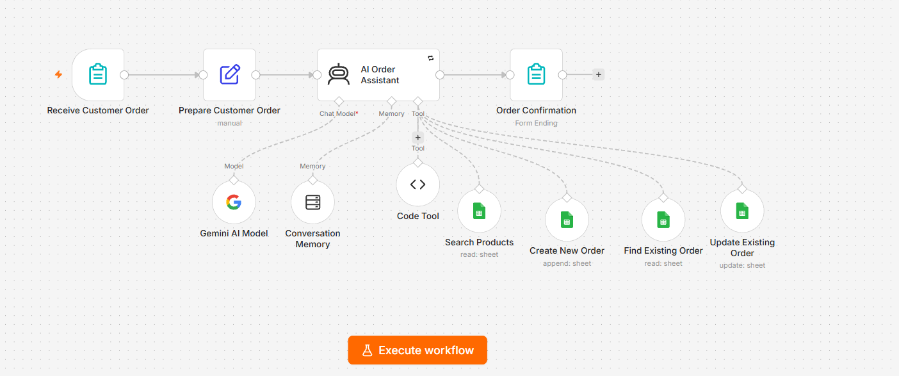

# 🛒 AI E-commerce Order Assistant

## 📸 Workflow

## 📌 Overview

An AI-powered e-commerce order assistant built with n8n, Google Gemini, and Google Sheets.

The workflow helps an online store automatically handle customer questions, verify product availability, create new orders, and update existing orders.

## ⚙️ Workflow

1. Receive customer order through an online form.
2. Prepare and validate customer information.
3. AI Assistant understands the customer's request.
4. Search Products checks product name, price, and stock.
5. The assistant verifies the order information.
6. Create New Order adds new orders to Google Sheets.
7. Find Existing Order and Update Existing Order manage existing orders.
8. FAQ provides answers about store policies.
9. Conversation Memory maintains the conversation context.

## 🤖 AI Responsibilities

- Understand customer requests.
- Search for product information.
- Check product availability.
- Answer frequently asked questions.
- Collect required order information.
- Create and update orders.
- Avoid inventing prices, stock, or order information.

## 🛠️ Technologies

- n8n
- Google Gemini
- Google Sheets
- AI Agent
- Simple Memory
- JavaScript / Code Tool

## 🔒 Security & Reliability

- API credentials are stored using n8n Credentials.
- The AI is instructed not to expose credentials or internal information.
- The workflow validates required customer information.
- AI retries are enabled for temporary failures.
- Orders are only created after product verification.

## 🧪 Testing

The workflow was tested with:

- Available products
- Unavailable products
- New orders
- Existing orders
- FAQ questions
- Product availability checks
- Order creation and updates

## 💼 Use Case

This automation can help e-commerce businesses reduce manual work by automating customer support and order management.

## 👩‍💻 Author

Sarra — AI Automation / n8n
